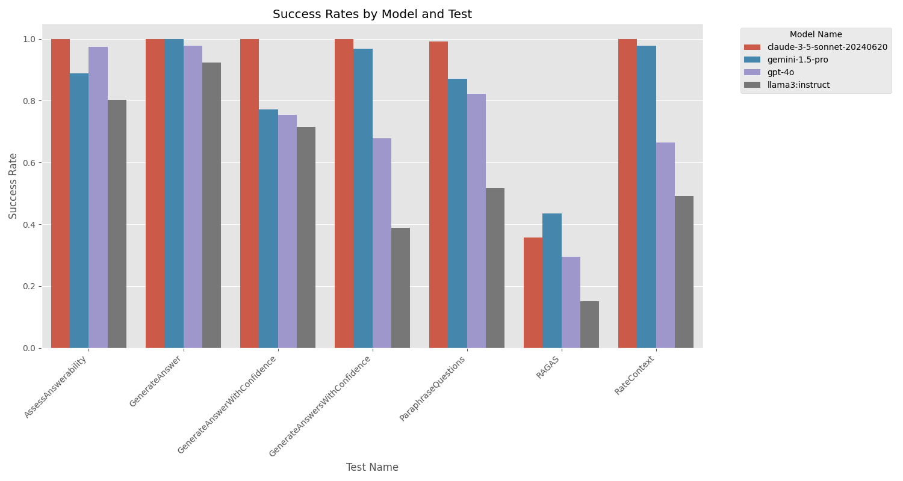

# StructuredRAG: JSON Response Formatting with Large Language Models

Our research paper is live on [ArXiv](https://arxiv.org/abs/2408.11061)!

Large Language Models have become extremely powerful at Zero-Shot Instruction Following. This benchmarker aims to target how well LLMs can follow the instruction of formatting its output in a particular JSON template. It is extremely important for processing Generative Feedback Loops that these outputs follow these instructions.

This benchmarker firstly compares `f-String` prompting with the `Follow the Format (FF)` method used in DSPy.

This benchmarker secondly compares `Gemini` with `Llama3 (Ollama)`.

The benchmarker explores different RAG inspired tasks with structured outputs as follows:

| Output Type                        | Task                        | Example                                                                                                                                           |
|-----------------------------|-----------------------------|---------------------------------------------------------------------------------------------------------------------------------------------------|
| `string`                      | GenerateAnswer              | {"answer": "The National Gallery of Art, Washington D.C., and the Pinacoteca di Brera, Milan, Italy."}                                             |
| `integer`                     | RateContext                 | {"context_score": 5}                                                                                                                              |
| `boolean`                     | AssessAnswerability         | {"answerable_question": True}                                                                                                                     |
| `List[string]`                | ParaphraseQuestions         | {"paraphrased_questions": ["Where can some of Vincenzo Civerchio’s works be found?", "Where are some pieces by Vincenzo Civerchio displayed?", "Where can I find some of Vincenzo Civerchio’s art?"]} |
| `RAGASmetrics`                 | RAGAS                       | {"faithfulness_score": 2.5, "answer_relevance_score": 1.0, "context_relevance_score": 3.5}
| `AnswerWithConfidence`        | GenerateAnswerWithConfidence| {"answer": "The National Gallery of Art, Washington D.C., and the Pinacoteca di Brera, Milan, Italy.", "confidence": 5}                            |
| `List[AnswerWithConfidence]`  | GenerateAnswersWithConfidence| [{"answer": "National Gallery of Art, Washington D.C.", "confidence": 5}, {"answer": "Pinacoteca di Brera, Milan, Italy", "confidence": 4}]         |

## Additional Models

```python
class RAGASmetrics(BaseModel):
  faithfulness_score: float
  answer_relevance_score: float
  context_relevance_score: float

class AnswerWithConfidence(BaseModel):
  answer: str
  confidence: float
```

The WikiQuestions dataset can also be found on [HuggingFace Datasets](https://huggingface.co/datasets/weaviate/Wiki-Answerable-Questions)!



## Citation
Please consider citing our paper if you find this work useful:

```bibtex
@misc{shorten2024,
      title={StructuredRAG: JSON Response Formatting with Large Language Models}, 
      author={Connor Shorten and Charles Pierse and Thomas Benjamin Smith and Erika Cardenas and Akanksha Sharma and John Trengrove and Bob van Luijt},
      year={2024},
      eprint={2408.11061},
      archivePrefix={arXiv},
      primaryClass={cs.CL},
      url={https://arxiv.org/abs/2408.11061}, 
}
```
