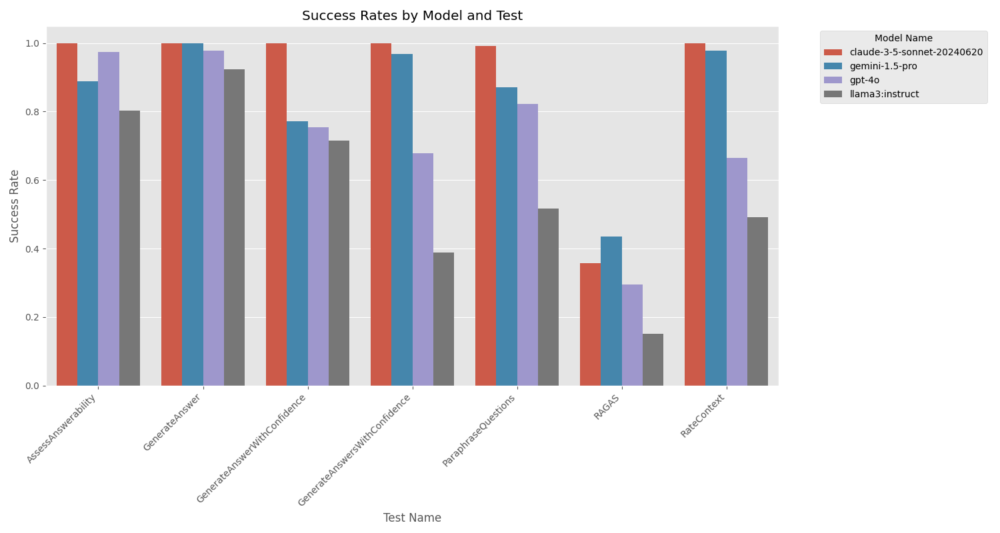

# StructuredRAG: JSON Response Formatting with Large Language Models

A benchmark for measuring how well LLMs follow JSON response format instructions across RAG-inspired tasks. Supports OpenAI, Anthropic, Google, Ollama, and Modal/vLLM providers out of the box.

Our research paper is on [ArXiv](https://arxiv.org/abs/2408.11061).



## Quick Start

```bash
uv sync
```

Set your API key and configure `structured_rag/configs/benchmark.yaml`:

```bash
export OPENAI_API_KEY=sk-...
```

```yaml
provider: openai          # openai | anthropic | google | ollama | ollama_cloud | modal_vllm
model: gpt-5.4-nano
api_key_env: OPENAI_API_KEY  # which env var to read the key from

strategy: fstring          # fstring | fstring_structured | dspy | dspy_opro | all
tasks:
  - AssessAnswerability    # or "all" for all 7 tasks

save_dir: results
```

Run:

```bash
uv run python -m structured_rag.scripts.run_benchmark
```

Or point to a custom config:

```bash
uv run python -m structured_rag.scripts.run_benchmark path/to/custom.yaml
```

## Tasks

The benchmark tests 7 RAG-inspired structured output tasks across different JSON complexity levels:

| Output Type | Task | Example |
|---|---|---|
| `string` | GenerateAnswer | `{"answer": "The National Gallery of Art..."}` |
| `integer` | RateContext | `{"context_score": 5}` |
| `boolean` | AssessAnswerability | `{"answerable_question": true}` |
| `List[string]` | ParaphraseQuestions | `{"paraphrased_questions": ["...", "...", "..."]}` |
| `composite` | GenerateAnswerWithConfidence | `{"answer": "...", "confidence": 5}` |
| `List[composite]` | GenerateAnswersWithConfidence | `[{"answer": "...", "confidence": 5}, ...]` |
| `multi-float` | RAGAS | `{"faithfulness_score": 2.5, "answer_relevance_score": 1.0, ...}` |

```python
class GenerateAnswerWithConfidence(BaseModel):
    answer: str
    confidence: int

class RAGAS(BaseModel):
    faithfulness_score: float
    answer_relevance_score: float
    context_relevance_score: float
```

## Prompting Strategies

| Strategy | Description |
|---|---|
| `fstring` | f-string prompting with inline JSON format instructions |
| `fstring_structured` | f-string prompting with provider-native structured outputs (OpenAI, Google) |
| `dspy` | DSPy Follow-the-Format (FF) prompting |
| `dspy_opro` | DSPy with OPRO-optimized JSON signature |
| `all` | Run all 4 strategies |

## Supported Providers

| Provider | Config value | API key env var |
|---|---|---|
| OpenAI | `openai` | `OPENAI_API_KEY` |
| Anthropic | `anthropic` | `ANTHROPIC_API_KEY` |
| Google Gemini | `google` | `GOOGLE_API_KEY` |
| Ollama (local) | `ollama` | -- |
| Ollama Cloud | `ollama_cloud` | `OLLAMA_API_KEY` |
| Modal vLLM | `modal_vllm` | `MODAL_API_KEY` |

## Metrics

The benchmark reports two separate scores:

- **JSON Format Success Rate** -- did the LLM produce valid, parseable JSON matching the expected schema?
- **Task Accuracy** -- for tasks with ground truth (e.g. AssessAnswerability), did the LLM get the right answer?

## Architecture

The codebase follows hexagonal (ports & adapters) architecture:

```
structured_rag/
  core/
    domain/       # Pydantic models, task definitions, validation metrics
    ports/        # Abstract interfaces (LLMPort, PromptingStrategy)
    services/     # Experiment runner, result saving
  adapters/
    llm/          # One adapter per provider (OpenAI, Anthropic, Google, Ollama, Modal/vLLM)
    prompting/    # Strategy implementations (f-string, DSPy)
  configs/        # benchmark.yaml
  scripts/        # run_benchmark.py entry point
```

Adding a new LLM provider requires creating one adapter file implementing `LLMPort` and registering it in `adapters/llm/registry.py`.

## Dataset

The WikiQuestions dataset contains 112 samples built from Wikipedia title-abstract pairs with generated answerable/unanswerable questions. Also available on [HuggingFace Datasets](https://huggingface.co/datasets/weaviate/Wiki-Answerable-Questions).

## News

- Weaviate Podcast #119 with Will Kurt and Cameron Pfiffer from dottxt.ai -- [YouTube](https://www.youtube.com/watch?v=3PdEYG6OusA) | [Spotify](https://spotifycreators-web.app.link/e/b8MEmkkbrSb)
- Weaviate Podcast #108 with Zhi Rui Tam on "Let Me Speak Freely?" -- [YouTube](https://www.youtube.com/watch?v=UsVIX9NJ_a4) | [Spotify](https://spotifyanchor-web.app.link/e/KkmrH99LkOb)

## Citation

```bibtex
@misc{shorten2024,
      title={StructuredRAG: JSON Response Formatting with Large Language Models}, 
      author={Connor Shorten and Charles Pierse and Thomas Benjamin Smith and Erika Cardenas and Akanksha Sharma and John Trengrove and Bob van Luijt},
      year={2024},
      eprint={2408.11061},
      archivePrefix={arXiv},
      primaryClass={cs.CL},
      url={https://arxiv.org/abs/2408.11061}, 
}
```
